# PythonGraphs
Hello~ (｡･∀･)ﾉﾞ
This is the submission of Mini_Task_3. 
I used Pokemon.csv for this task. This project explores the Pokémon dataset using Python, Pandas, Matplotlib, and Seaborn. The goal was to practice data visualization by creating different types of plots and analyzing patterns in Pokémon stats and attributes. (ง •_•)ง
I used-
python, Pandas, Matplotlib and Seaborn.
I also used Jupyter Notebook for execution. 
Here are the graphs that I've plotted inside the code (。・ω・。)

## Data Visualizations

### Line Plot
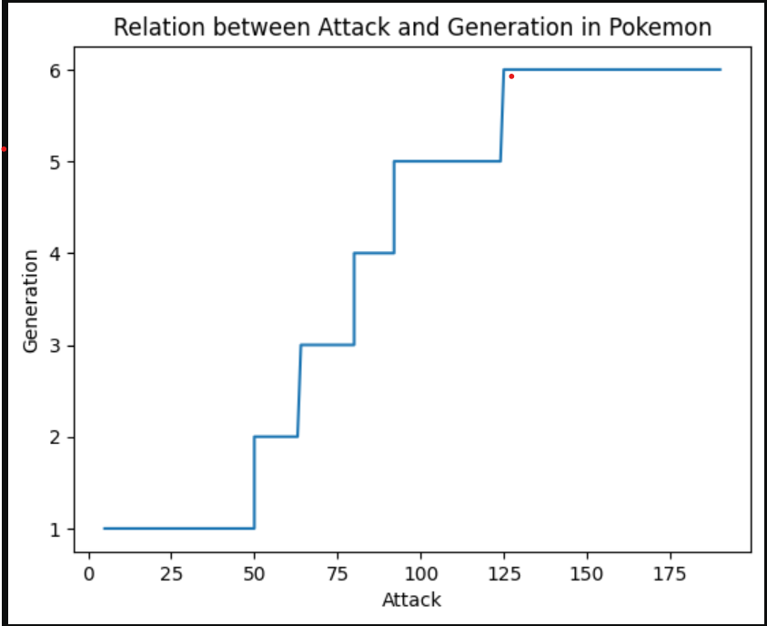

### Bar Chart
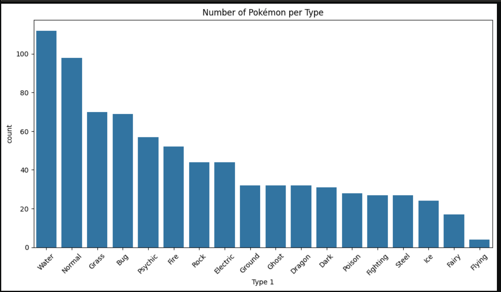

### Histogram
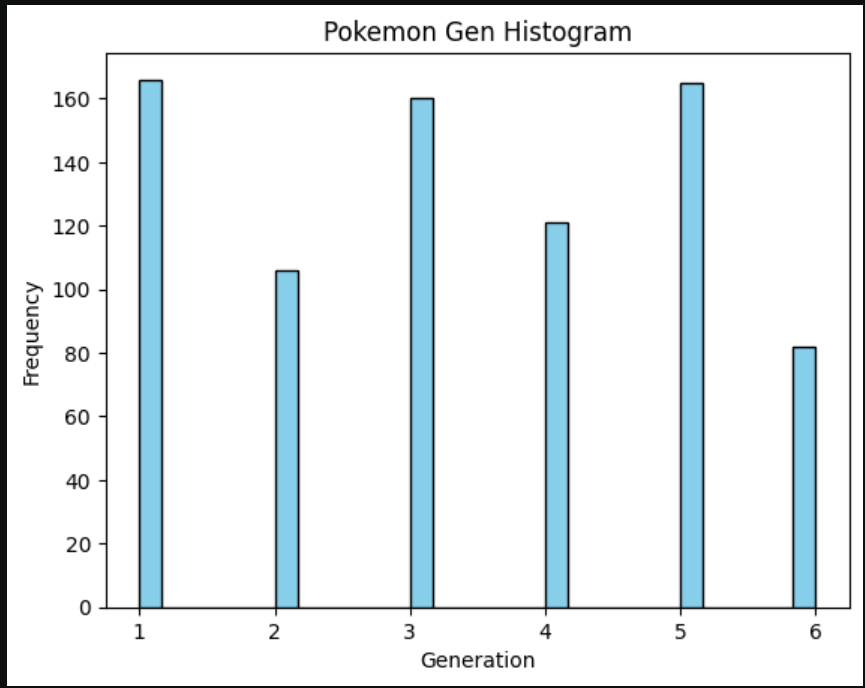

### Pie Chart
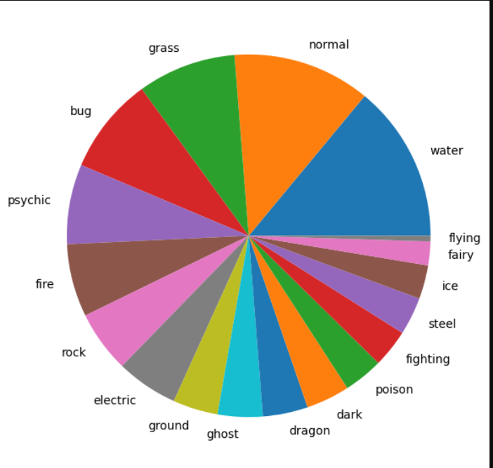

### Scatter Plot
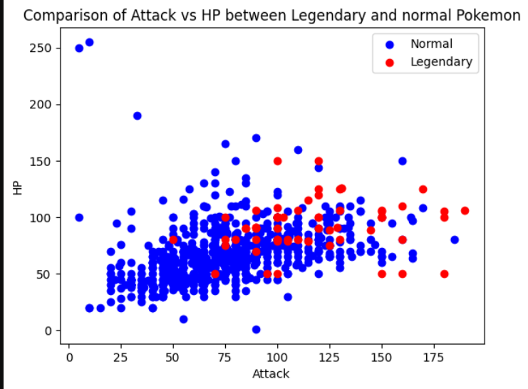

### Count Plot
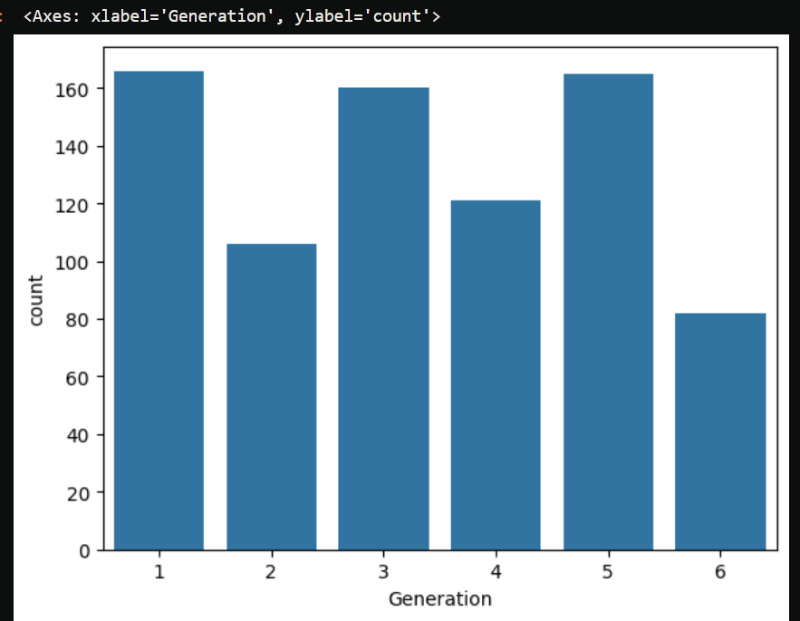

### Box Plot
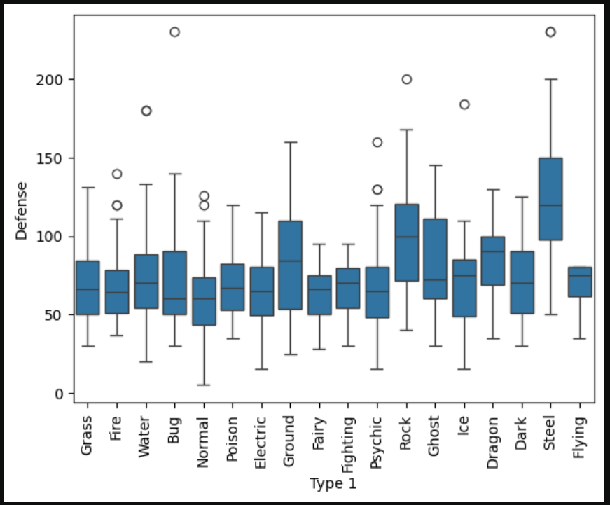

### Violin Plot
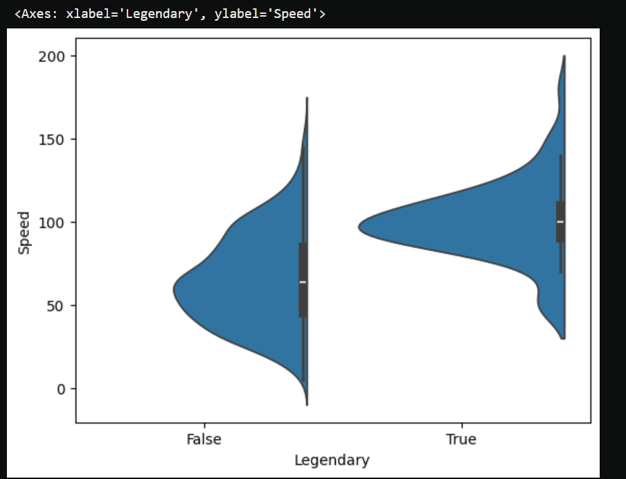

### Strip Plot
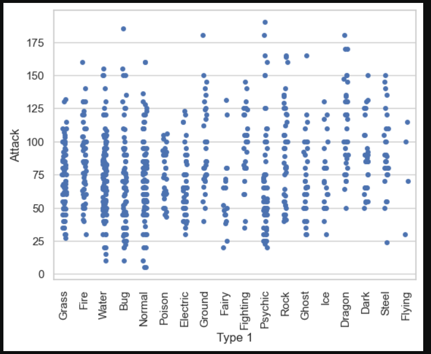

### Swarm Plot
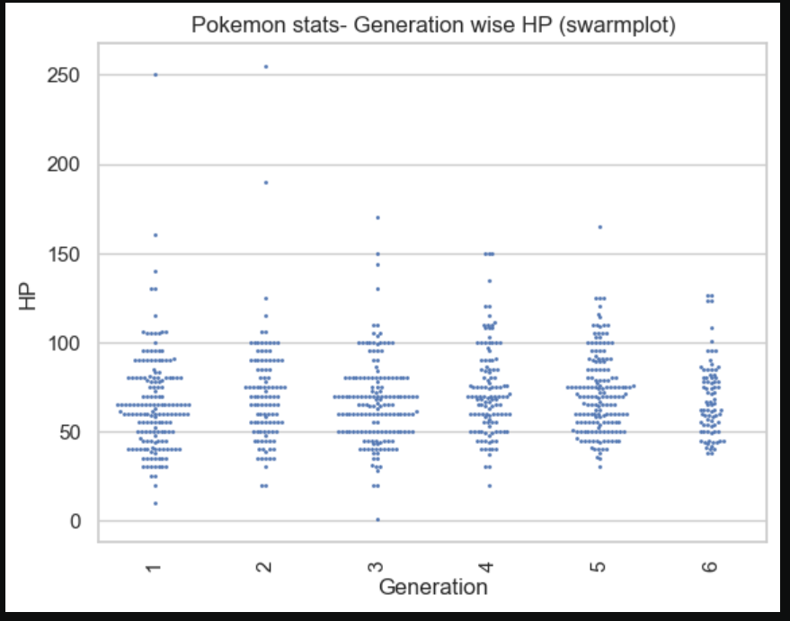

### Heat Map
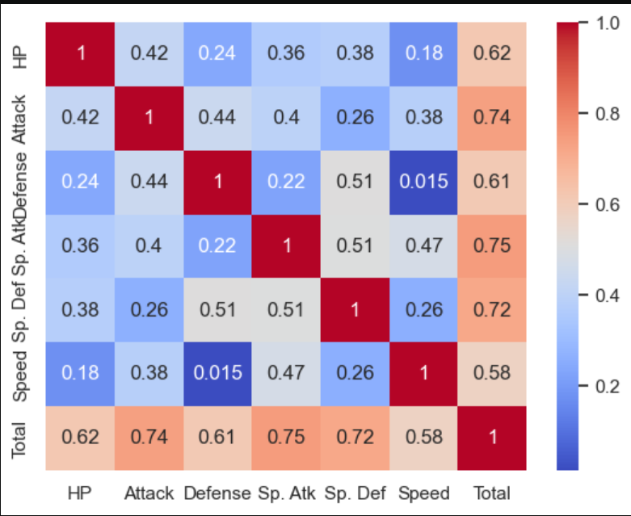

### Pair Plot
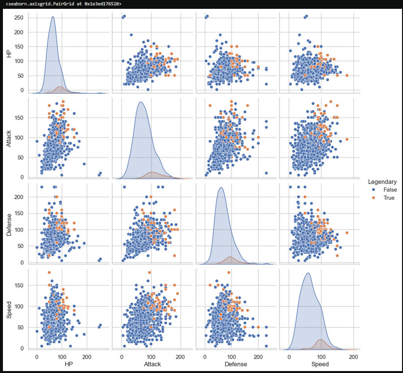

